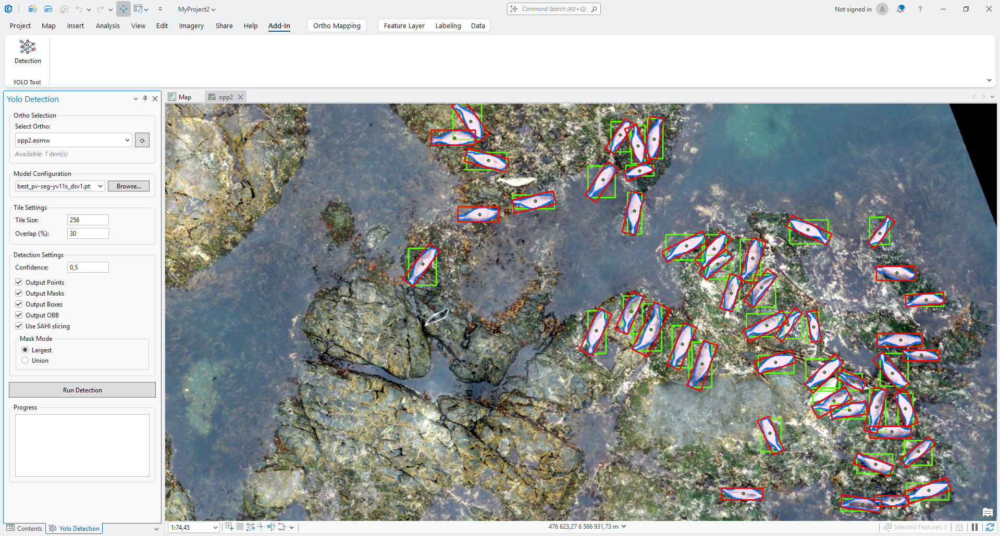

# ArcGIS Pro YOLO Detection Tool


---

## 📖 Описание проекта

**ArcGisProAppYolo** — это надстройка (Add-in) для **ArcGIS Pro 3.7**, которая интегрирует **Ultralytics YOLO (You Only Look Once)** object detection непосредственно в рабочую среду ArcGIS Pro. 

Проект предоставляет удобный UI для:
- ✂️ **Нарезки ортофотопланов на тайлы** с настраиваемым размером и overlap
- 🤖 **Запуска детекции объектов** с использованием YOLO + SAHI (sliced inference + NMS)
- 📊 **Автоматического импорта результатов** (точки, маски, bounding boxes, OBB) в виде shapefiles
- 🗺️ **Интеграции результатов** в структуру проекта ArcGIS Pro

### 🎯 Цель проекта
Упростить workflow детекции объектов на ортофотопланах для GIS-специалистов, позволяя выполнять весь процесс — от нарезки тайлов до визуализации результатов — внутри одной среды ArcGIS Pro.
---

## 🛠️ Технологический стек

### Frontend (ArcGIS Pro Add-in)
- **ArcGIS Pro SDK**: 3.7.0.1901
- **.NET**: 10.0
- **C#**: 12.0
- **WPF**: для UI с MVVM паттерном
- **XAML**: декларативное описание интерфейса

### Backend (Python Processing)
- **Python**: 3.9+ (ArcGIS Pro Python environment)
- **Ultralytics YOLO**: для object detection
- **SAHI**: sliced prediction и постобработка (NMS)
- **PyTorch**: бэкенд для нейронных сетей
- **ArcPy**: для работы с геопространственными данными

### Инструменты разработки
- **Visual Studio 2026** (18.4.1+)
- **ArcGIS Pro 3.7**
- **PyCharm 2026**
- **Git/GitHub**: контроль версий
- **NuGet**: управление зависимостями .NET

---

## 📁 Структура проекта

```
ArcGisProAppYolo/
├── 📄 Config.daml                    # Конфигурация Add-in (DAML)
├── 📄 Module1.cs                     # Главный модуль Add-in
│
├── 📂 Controls/                      # UI элементы управления
│   └── ShowYoloDock.cs              # Кнопка для открытия панели
│
├── 📂 DockPanes/                     # Панель инструментов (MVVM)
│   ├── YoloDockPane.cs              # ViewModel (бизнес-логика)
│   ├── YoloDockPaneView.xaml        # View (UI разметка)
│   └── YoloDockPaneView.xaml.cs     # View code-behind
│
├── 📂 Infrastructure/                # Вспомогательные классы
│   └── RelayCommand.cs              # ICommand implementation
│
├── 📂 Tools/                         # Бизнес-логика
│   ├── Logger.cs                    # Логирование
│   ├── TileGenerator.cs             # Генерация тайлов
│   ├── PythonRunner.cs              # Запуск Python скриптов
│   └── ResultImporter.cs            # Импорт результатов
│
├── 📂 opp_yolo_tool/                 # Python модули
│   ├── models.py                    # Определение моделей
│   ├── utils.py                     # Вспомогательные функции
│   ├── predict_module.py            # YOLO детекция
│   ├── tile_generator.py            # Генерация тайлов (arcpy)
│   ├── create_dataset_module.py     # Формирование train/valid/test + label .txt
│   └── augmentation_module.py       # Аугментация изображений и аннотаций
│
└── 📂 Images/                        # Иконки Add-in
```

### 📦 Структура результатов Create Dataset

```
OrthoMapping/<OrthoName>/DataSet/<experiment_name>/
├── train/
│   ├── images/
│   └── labels/
├── valid/
│   ├── images/
│   └── labels/
├── test/
│   ├── images/
│   └── labels/
├── debug/                              # при включенном DebugMode
│   ├── train/
│   ├── valid/
│   └── test/
├── data.yaml
├── hyp.yaml
├── augmentation_config.yaml
├── dataset_report.txt
├── dataset_build_summary.json
├── augmentation_run_summary.json
├── create_dataset_stdout.log
├── create_dataset_stderr.log
├── augmentation_stdout.log
└── augmentation_stderr.log
```

### 🧩 Модуль `augmentation_module.py`

Модуль выполняет аугментацию уже сформированного YOLO-датасета (`train/valid/test`):

- детерминированные преобразования (`rot90`, `rot180`, `rot270`, `fliph`, `flipv`, `fliph_rot90`, `fliph_rot270`);
- случайные геометрические, цветовые, шумовые и advanced-аугментации (`mosaic`, `mixup`, `copy-paste`, `cutout`, `erasing`);
- синхронное обновление аннотаций `.txt` для каждого созданного изображения;
- debug-визуализация аннотаций на аугментированных вариантах (если включен `--debug`).

---

## 🚀 Установка и запуск

### Требования
- ✅ **ArcGIS Pro 3.7** (установлен и активирован)
- ✅ **Visual Studio 2026** (18.4.1+) с ArcGIS Pro SDK
- ✅ **Python 3.9+** (встроенный в ArcGIS Pro)
- ✅ **Ultralytics YOLO** и **PyTorch** (для детекции)

### 1️⃣ Установка зависимостей Python

Откройте **Python Command Prompt** из ArcGIS Pro:

```bash
# Клонируйте среду arcgispro-py3 по умолчанию, чтобы создать среду с именем arcgispro-py3-clone.
conda create --clone arcgispro-py3 --name arcgispro-py3-clone --pinned

Флаг --pinned, представленный компанией Esri, переносит закрепленный файл из исходной среды в клонированную. Используйте этот флаг, чтобы обеспечить целостность клонированной среды при обновлении или установке пакетов.

# Активировать окружение ArcGIS Pro
activate arcgispro-py3-clone

# Установить Ultralytics YOLO
conda install ultralytics

# Установить SAHI для sliced inference
conda install conda-forge::sahi

```

### Создание датасета (ArcGIS Pro Python, требуется `arcpy`)

```bash
python opp_yolo_tool/create_dataset_module.py \
  --tiles-folder "C:\MyProject\OrthoMapping\Ortho_2024_01\Tiles\640px" \
  --dataset-root "C:\MyProject\OrthoMapping\Ortho_2024_01\DataSet\exp_001" \
  --train 70 --val 20 --test 10 \
  --seed 12345 \
  --layers "buildings_train|roads_train" \
  --dataset-type "Segmentation" \
  --aprx "C:\MyProject\MyProject.aprx" \
  --debug --debug-dir "C:\MyProject\OrthoMapping\Ortho_2024_01\DataSet\exp_001\debug"
```

### Аугментация датасета

```bash
python opp_yolo_tool/augmentation_module.py \
  --dataset-root "C:\MyProject\OrthoMapping\Ortho_2024_01\DataSet\exp_001" \
  --config "C:\MyProject\OrthoMapping\Ortho_2024_01\DataSet\exp_001\augmentation_config.yaml" \
  --max-per-image 4 \
  --apply-to-val \
  --debug --debug-dir "C:\MyProject\OrthoMapping\Ortho_2024_01\DataSet\exp_001\debug"
```

📚 **Документация по Python в ArcGIS Pro:**
- [Установка Python для ArcGIS Pro](https://pro.arcgis.com/ru/pro-app/latest/arcpy/get-started/installing-python-for-arcgis-pro.htm)
- [Использование Conda с ArcGIS Pro](https://pro.arcgis.com/ru/pro-app/latest/arcpy/get-started/using-conda-with-arcgis-pro.htm)
- [Package Manager](https://doc.esri.com/en/arcgis-pro/latest/arcpy/get-started/what-is-conda.html)
- [Поиск пакетов conda и Python](https://anaconda.org/)

### 2️⃣ Сборка Add-in

В Visual Studio:

1. Откройте `ArcGisProAppYolo.sln`
2. **Build → Clean Solution**
3. **Build → Rebuild Solution**
4. Проверьте: **0 errors**

### 3️⃣ Очистка кэша ArcGIS Pro (ОБЯЗАТЕЛЬНО!)

Перед запуском после каждой пересборки:

```powershell
Remove-Item "$env:LOCALAPPDATA\ESRI\ArcGISPro\AssemblyCache\{a79ff6b9-f9a2-4dc3-8cdb-820811bb9ad8}" -Recurse -Force
```

### 4️⃣ Разместите файлы python из `opp_yolo_tool` в директории `C:\Users\<User_Name>\AppData\Local\ESRI\ArcGISPro\opp_yolo_tool`

### 4️⃣ Запуск отладки

1. Нажмите **F5** в Visual Studio
2. ArcGIS Pro запустится автоматически
3. Откройте или создайте проект
4. На вкладке **Add-In** найдите кнопку **YOLO Tool**
5. Откроется панель справа

---

## 🧩 Добавление в ArcGIS Pro
Скачайте архив на странице релиза [ArcGisProAppYolo.1.1.0-windows.rar](https://github.com/gdenis82/ArcGisPro_Yolo_Tools/releases)

```text
Распакуйте архив ArcGisProAppYolo.1.1.0-windows.rar
Дважды кликните по файлу ArcGisProAppYolo.esriAddinX (находится в папке ArcGisProAppYolo.1.0.0-windows)
Нажмите Install Add-In в окне установщика
Перезапустите ArcGIS Pro
Инструмент появится на ленте в соответствующей вкладке
Разместите папку opp_yolo_tool в расположении ArcGISPro: C:\Users\<USERNAME>\AppData\Local\ESRI\ArcGISPro\opp_yolo_tool
```

### Способ 1: Самый простой (двойной клик)
1. Закройте ArcGIS Pro (если он открыт).
2. Перейдите в папку плагина.
3. Найдите файл ArcGisProAppYolo.esriAddinX и дважды кликните по нему.
4. Откроется окно установщика ArcGIS Pro Add-In. Нажмите Install Add-In.

### Способ 2: Через ArcGIS Pro
1. Откройте ArcGIS Pro.
2. Перейдите на вкладку Settings (Настройки) -> Add-In Manager (Диспетчер надстроек).
3. В меню выберите Options (Параметры).
4. Добавьте путь размещения папки с файлом .esriAddinX.
5. Установите "Load all Add-Ins without restrictions (Least Secure)"


## 📋 Использование

### Шаг 1: Подготовка данных

Создайте структуру в вашем проекте ArcGIS Pro:

```
MyProject/
├── MyProject.aprx
└── OrthoMapping/
    ├── Ortho_2024_01/
    │   └── ortho.tif          # Ортофотоплан
    └── Ortho_2024_02/
        └── ortho.tif          # Другой ортофотоплан
```

### Шаг 2: Настройка параметров

В панели **YOLO Tool**:

1. **Ortho Selection** — выберите ортофотоплан из списка
2. **Model Configuration** — укажите путь к YOLO модели (`.pt` файл)
   - Поддерживается история ранее выбранных моделей (ComboBox)
3. **Tile Settings**:
   - Tile Size: `640` (рекомендуемый размер для YOLO)
   - Overlap %: `30` (перекрытие между тайлами)
4. **Detection Settings**:
   - Confidence: `0.5` (порог уверенности)
   - Output Points: ✅ (центроиды объектов)
   - Output Masks: ✅ (полигоны масок)
   - Output BBoxes: ✅ (прямоугольники)
    - Output OBB: ✅ (ориентированные прямоугольники)
   - Mask Mode:
     - `Largest` — 1 маска = 1 объект (крупнейший контур)
     - `Union` — объединение всех контуров в одну геометрию

### Шаг 3: Запуск детекции

1. Нажмите **Run Detection**
   - Во время выполнения кнопка переключается в **Cancel**
2. Процесс:
   - ✂️ Генерация тайлов (`OrthoMapping/<OrthoName>/Tiles/Images/`)
   - 🤖 Запуск YOLO детекции
   - 📊 Создание shapefiles
    - 📁 Запись результатов в `Detection_Results/<experiment_name>/`

### Шаг 4: Просмотр результатов

Результаты сохраняются в:
```
OrthoMapping/<OrthoName>/
├── Tiles/
│   └── <TileSize>px/
│       ├── Images/            # Тайлы изображений
│       └── shapes/            # Сетка тайлов (shapefile)
└── Detection_Results/
    └── <experiment_name>/
        ├── all_detections_sahi.json
        ├── Detected_Points.shp    # Центроиды объектов
        ├── Detected_Masks.shp     # Полигоны масок
        ├── Detected_BBoxes.shp    # Bounding boxes
        ├── Detected_OBB.shp       # Oriented bounding boxes
        ├── predict_stdout.log
        └── predict_stderr.log
```

---

## 🐞 Отладка и логирование

### Логи в Visual Studio

- **View → Output** → выберите **Debug**
- Все операции логируются с временными метками

### Лог-файл

Лог сохраняется в:
```
%TEMP%\ArcGisProAppYolo_YYYYMMDD.log
```

При открытии панели путь выводится в Output Window:
```
Log file location: C:\Users\...\Temp\ArcGisProAppYolo_20260622.log
```

### 🛠️ Типичные проблемы

### 🔴 Предупреждение не совместимости пакетов torchvision и torch
WARNING torchvision==0.25 is incompatible with torch==2.9.
Run 'pip install torchvision==0.24' to fix torchvision or 'pip install -U torch torchvision' to update both.
For a full compatibility table see https://github.com/pytorch/vision#installation 

**Одно из возможных решений:** 
```
conda uninstall pytorch torchvision -y
pip install torch torchvision --index-url https://download.pytorch.org/whl/cu128
pip install ultralytics-thop opencv-python
```

#### 🔴 Панель пустая
**Решение:** Очистите кэш и пересоберите проект

#### 🔴 Ортофотопланы не найдены
**Решение:** Проверьте структуру папки `OrthoMapping/` в корне проекта

#### 🔴 Python скрипт не запускается
**Решение:** Проверьте путь к Python и установленные зависимости

---

## 🧪 Ручной запуск Python модуля

Для тестирования без ArcGIS Pro:

### Нарезка тайлов

```bash
python opp_yolo_tool/tile_generator.py \
  --ortho-image "C:\MyProject\OrthoMapping\Ortho_2024_01\ortho.tif" \
  --tiles-folder "C:\MyProject\OrthoMapping\Ortho_2024_01\Tiles" \
  --tile-size 640 \
  --overlap 30
```

### Предсказание

```bash
python opp_yolo_tool/predict_module.py \
  --tiles-dir "C:\MyProject\OrthoMapping\Ortho_2024_01\Tiles" \
  --model "C:\Models\yolo11x-seg.pt" \
  --confidence 0.5 \
  --outputs point,bbox,mask,obb \
  --mask-mode largest
```

---

## 📚 Документация

- 📗 [ArcGIS Pro SDK Wiki](https://github.com/Esri/arcgis-pro-sdk/wiki)
- 📕 [ProGuide: Dockpanes](https://github.com/Esri/arcgis-pro-sdk/wiki/ProGuide-Dockpanes)
- 📙 [API Reference](https://pro.arcgis.com/en/pro-app/latest/sdk/api-reference)

---

## 🤝 Contributing

Pull requests приветствуются! Для крупных изменений сначала откройте issue для обсуждения.

---

## 📄 License

MIT License

---

## 👨‍💻 Автор

**gdenis82** - [GitHub](https://github.com/gdenis82)

---

## ⭐ Благодарности

- [Esri ArcGIS Pro SDK](https://github.com/Esri/arcgis-pro-sdk)
- [Ultralytics YOLO](https://github.com/ultralytics/ultralytics)

---

